DL Malloc源码 : http://gee.cs.oswego.edu/dl/

 

 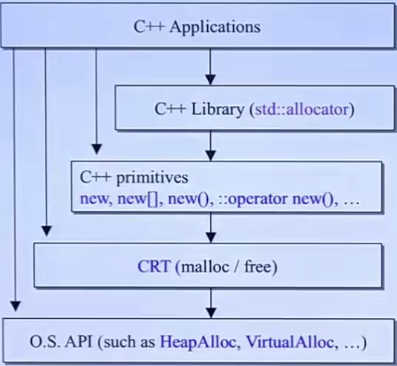

## C++ memory primitives

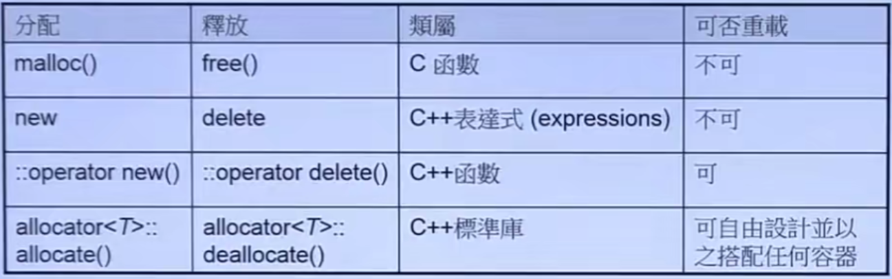

```c++
void* p1 = malloc(512); //512 bytes
free(p1);

complex<int>* p2 = new complex<int>; // one object
delete p2;

void* p3 = ::operator new(512); //512 bytes
::operator delete(p3);

#ifdef _MSC_VER
	//分配3个ints
	int* p4 = allocator<int>.allocate(3, (int*)0);
	allocator<int>.deallocate(p4, 3);
#endif

#ifdef __BORLANDC__
	//分配5个ints
	int* p4 = allocator<int>().allocate(5);
	allocator<int>.deallocate(p4, 5);
#endif

#ifdef __GUNC__
	//下面两个函数是static，可以通过全名调用（2.9版本）
	void* p4 = alloc::allocate(512);
	alloc::deallocate(p4, 512);
endif
    
#ifdef __GUNC__
	//下面的函数是non-static，通过object调用 （4.9版本）
	void* p4 = allocator<int>().allocate(7);
	allocator<int>.deallocate((int*)p4, 7);

	void* p5 = __gnu_cxx::__pool_alloc<int>().allocate(9);
    __gnu_cxx::__pool_alloc<int>().deallocate((int*)p5, 9);
#endif
```

### new expression

```c++
Complex* pc = new Complex(1, 2);
//等价于
void* mem = operator new(sizeof(Complex));//分配内存，底层调用malloc
pc = static_cast<Complex*>(mem);
pc->Complex::Complex(1, 2);//调用构造函数，无法直接调用
//如果想直接调用构造函数，可以使用placement new
new(p) Complex(1, 2);
```

### delete expression

```c++
delete pc;
//等价于
pc->Complex(); //先析构，可以直接调用
operator delete(pc); //再释放内存，底层调用free
```

### array new, array delete

```c++
Complex* pca = new Complex[3]; //调用3次构造函数，系统并分配cookie(记录数组信息，比如长度) + 数据
Complex* tmp = pca;
for(int i = 0; i < size; ++i)
{
    new(tmp++)pca(i); //从上往下依次调用构造函数 Complex(int i): id(i) {cout << i;}
}
delete[] pca; //调用3次析构函数
//如果是有意义的析构函数的object类型，不加[]，则只会调用一次，可能造成内存泄露
```

### array size, in memory block

```c++
int *pi = new int[10];
delete pi; //不需要加[]，因为int类型没有析构函数，不存在内存泄露的情况
```

 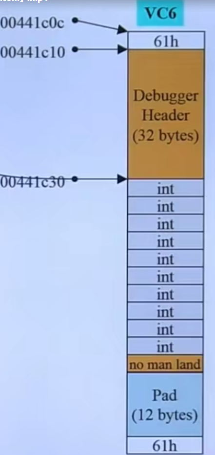

```c++
Demo* p = new Demo[3];
delete[] p; //Demo object的析构函数是有意义的，那么需要加上[]，调用3次析构函数
```

 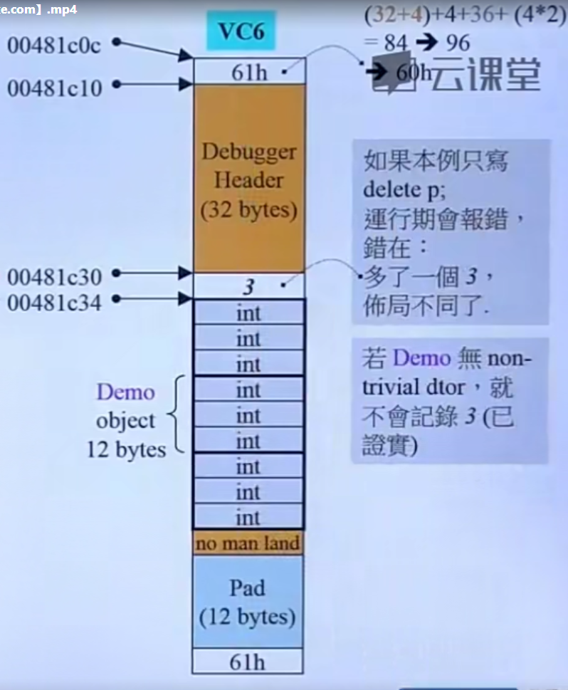

### placement new

允许将object创建在allocated memory中，定点创建object。

```cpp
new(p) 或者 ::operator new(size, void*)
```

```cpp
char* buf = new char[ sizeof(Complex) * 3 ];
Complex* pc = new(buf)Complex(1, 2);
//等价于
void* mem = operator new(sizeof(Complex), buf);
pc = static_cast<Complex*>(mem);
pc->Complex::Complex(1, 2);
```

我们可以重载全局`::operator new(size_t)`和`::operator delete(void*)`，也可以重载类成员`classname::operator new(size_t)`和`classname::operator delete(void*)`，作为类成员默认是static，因为需要在创建对象之前调用。

**容器Container\<T>**

```cpp
T* p = allocate(); --> std::allocator --> ::operator new(size_t) --> malloc(size_t)
construct();
...
destroy();
deallocate p; --> std::allocator -> ::operator delete(void*) --> free(void*)
```


**重载placement new**

第一参数必须为要创建对象的大小，其余参数随意指定。

```cpp
new(500,'c') Foo;  //对应写出 --> void operator new(size_t, size_t, char){...}
```


### class allocator

内存池：

先分配一大块，再切割成小块，这样只需要调用1次malloc函数，并且cookie只存在一份。

1. 降低malloc的调用次数（时间）
2. 降低cookie的用量（空间）

将分配的大块内存切割成小块，并转换为单链表，那么需要一个指向该class对象的指针来遍历单链表。

数据和指针可以通过union来共用同一段内存，使用embedded pointer，从而节省多余的指针带来的内存消耗。

重载 `void* operator new(size_t size)`。

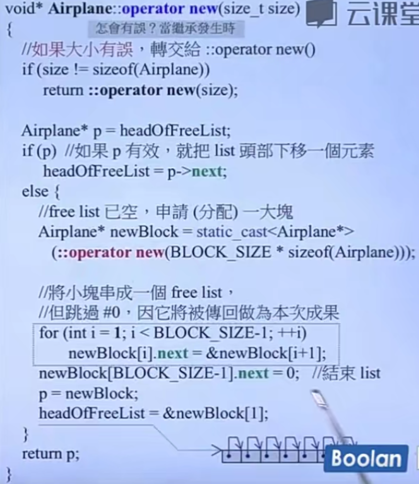

重载`void* operator new(size_t size)`。 delete时，将节点链接在链表头部。

 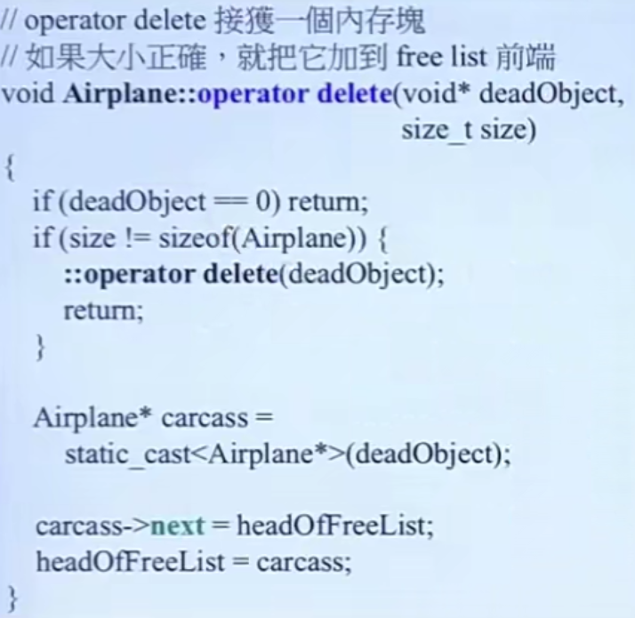

**static allocator**

将allocator包装成一个类，可以重复使用。

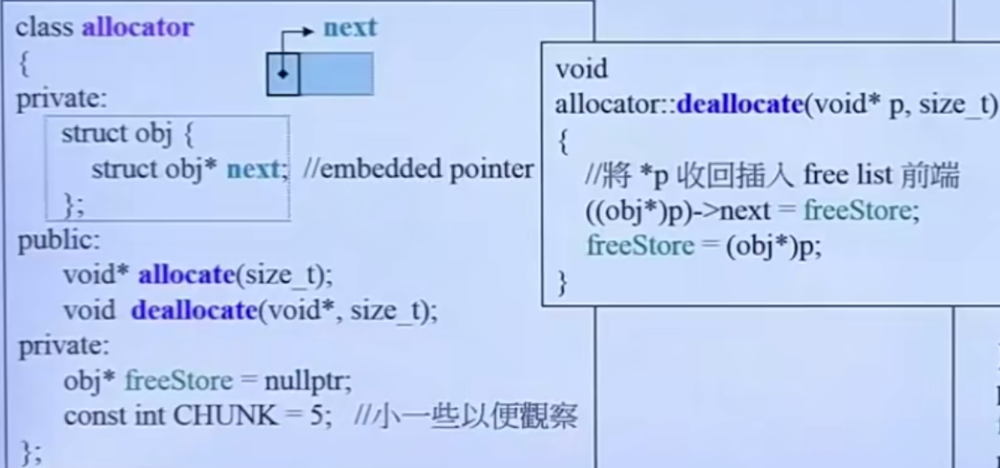

 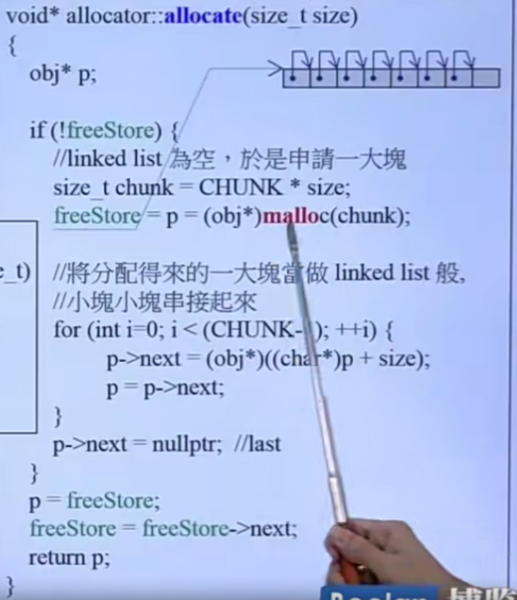

 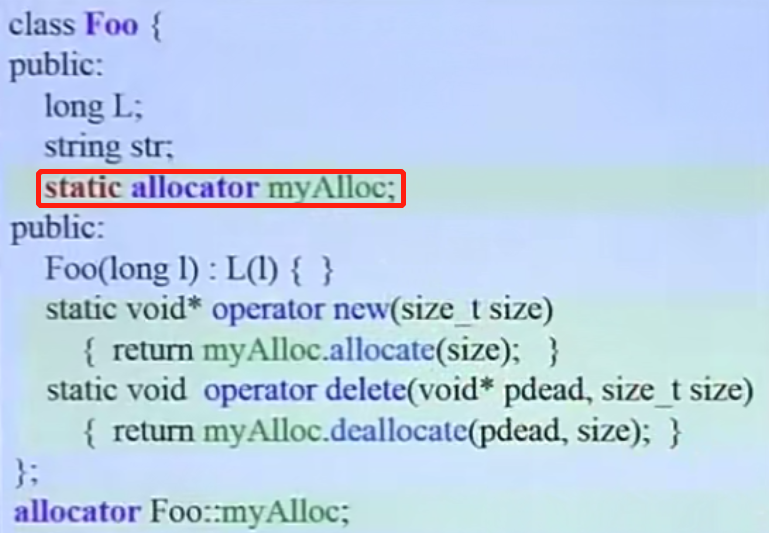

**macro for static allocator**

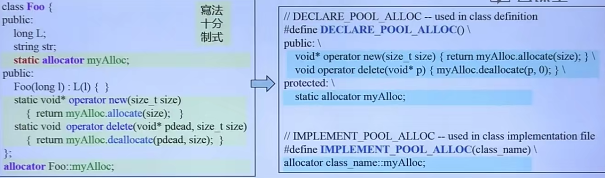

 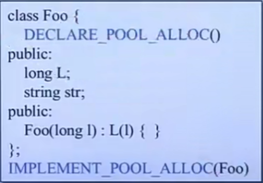

**new handler**

当operator new没能力分配申请的memory，则会抛出`std::bad_alloc`exception，老编译器返回0。

```cpp
new(nothrow) Foo; //没能力分配内存时，返回0
```

在申请内存发现内存不够时，抛出异常之前会先重复调用一个由client指定的handler。

```cpp
typedef void(*new_handler)();
new_handler set_new_handler(new_handler(p)) throw;
```

设计良好的`new_handler`

+ 让更多的memory可用
+ 调用`abort()`或`exit()`

## std::allocator

GNU使用的分配器不是`std::allocator`，而是`td::alloc`。

