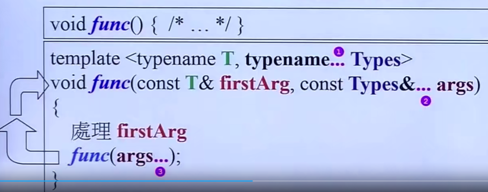
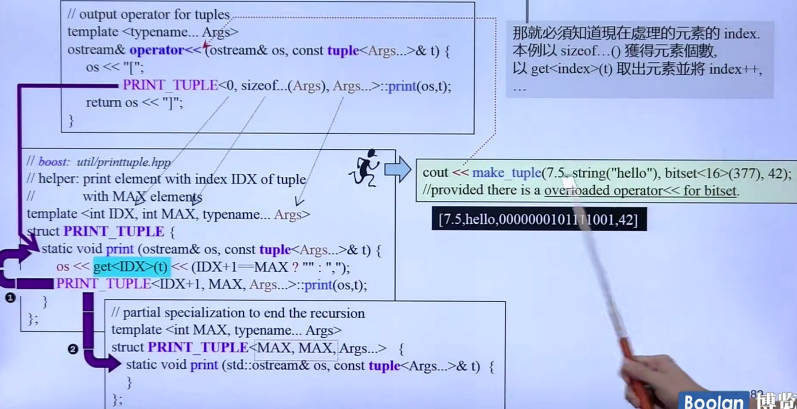
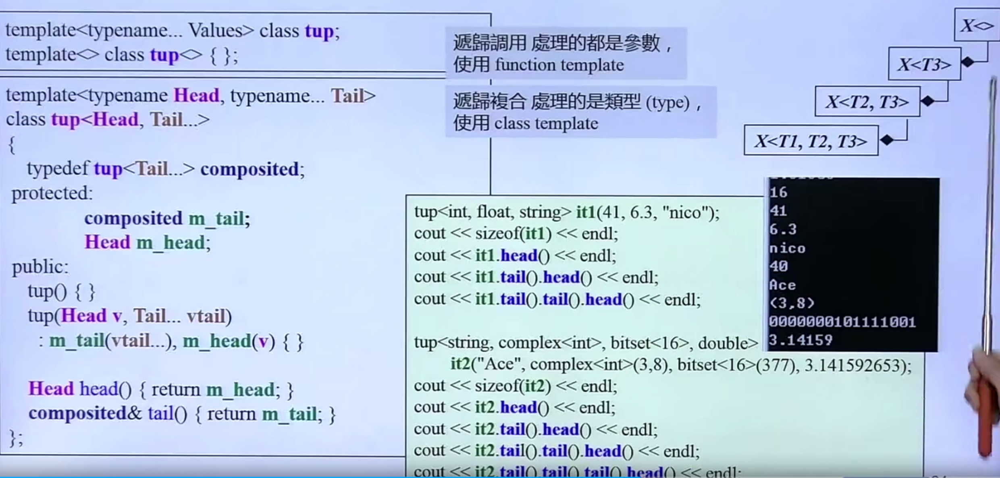
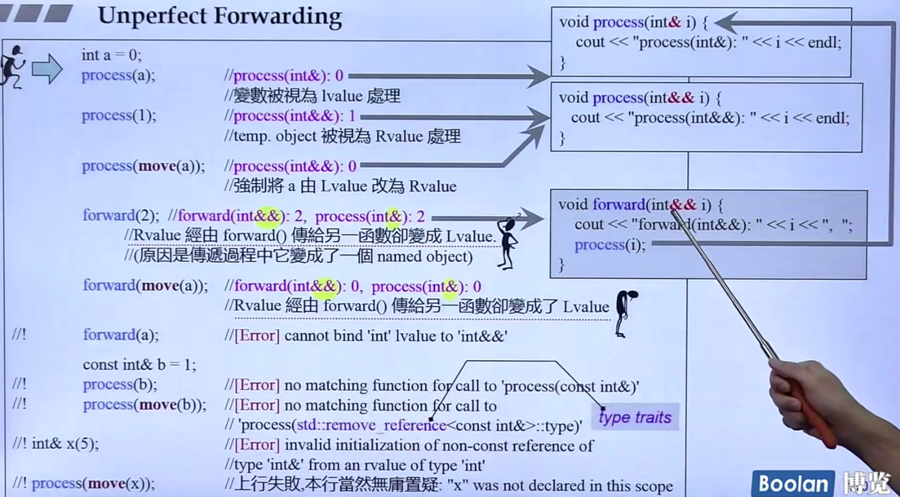
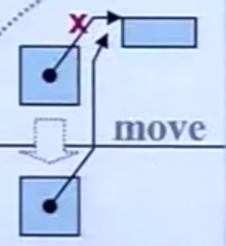
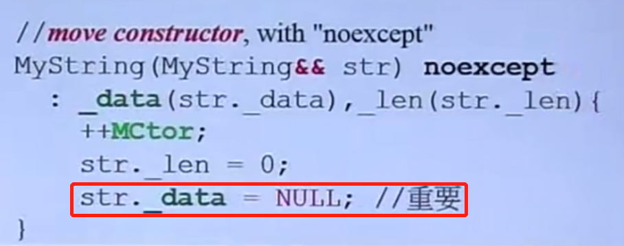
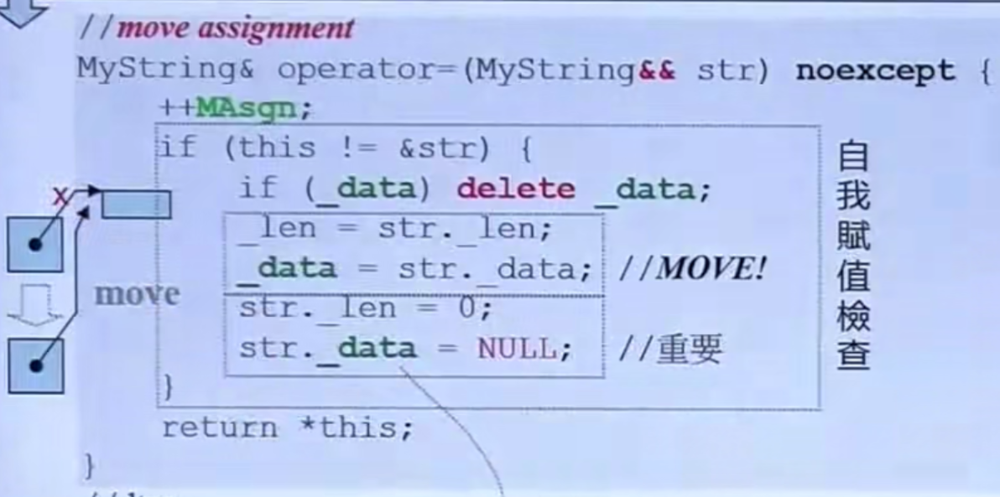
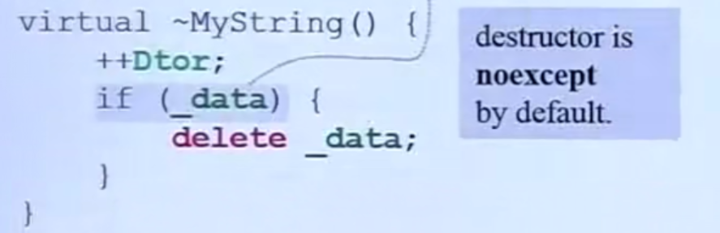
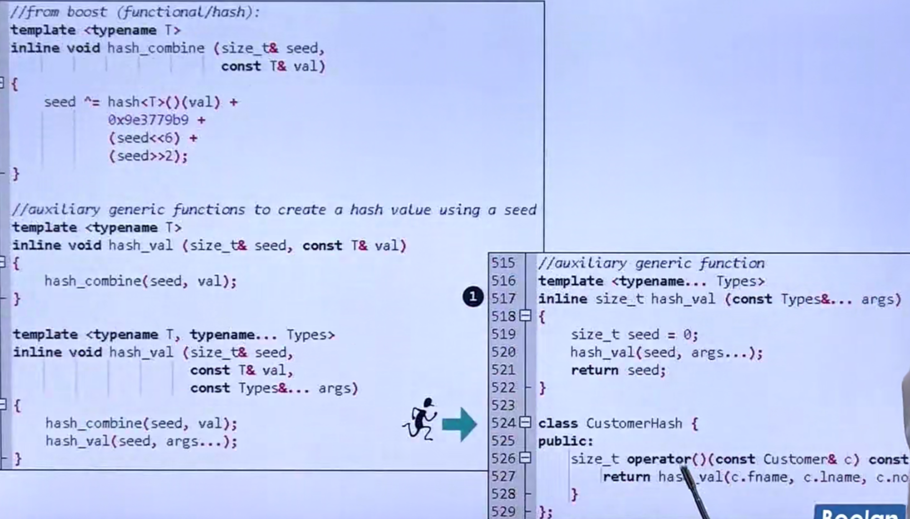

### 网页

C++之父网页 ---- "C++11 - the new ISO C++ standard"
CPlusPlus.com  -- Reference查询资料
CppReference.com
gcc.gnu.org

### 书籍
《Effective Modern C++》（只讲新东西）
《C++ Primer》百科全书
《The C++ Programming Language》百科全书（C++之父所写）
《The C++ Standard Library》

### Header Files

C++ header files 不带后缀名，例如`#include <vector>`
C header files 不带后缀名，例如`#include <cstdio>` 

### Variadic Templates

数量不定的模板参数，可以传递任意个数、任意类型的参数，类型在调用时绑定。

如果参数类型相同，则不需要使用variadic Templates，只需使用`Initialist<T>`即可



+ **用于函数函数模板**

用作函数递归调用，需要设置无参的同名函数，用作递归出口函数，参数数量为0时调用。


+ **用于类模板**

用作类的递归继承，需要设置无参的模板类


+ **用于递归创建**

创建对象的同时，调用函数，递归创建对象，相当于递归调用函数。



+ **递归复合**

在类内部声明包含其余参数的成员对象，并在构造函数初始化列表中初始化。



### 模板嵌套

C++11之前必须写为 `vector<list<int> >`，即最后一个`>`前要有空格。
C++11之后可以写为`vector<list<int>>`，不需要空格。

## nullptr和std::nullptr

`nullptr`用来指代**空指针**，类型是`std::nullptr`。不使用`NULL`和`0`

## auto

实参推导机制，自动类型推断。

`auto x = 1`

```cpp

    vector<int> v;
    auto it = v.begin() //type of it is vector<int>::iterator

    auto l = [](int x) -> bool{
        ...;
    }       //type of l is a lambda, representing object
```

## Uniform Initialization

初始化时，可以是使用同一种语法

```cpp

    int values[] {1, 2, 3};
    vector<int>v {2,3,4};

```

编译器看到`{}`会产生一个`initializer_list<T>`,可以接收**数量不定的参数**;关联`array<T,n>`,`n`是指n个元素。
这个可以用来**设初值**：

```cpp

    int i;      //undefined
    int i{};    //0
    int *p;     //undefined
    int *p{};   //nullptr

```

## explicit

通常用在构造器上，表示禁止在初始化时做隐式类型转换。

`begin(), end()`是两个全局函数，可以接收容器。

## =default, =delete

=default表示默认实现
=delete表示不用此函数

通常用于构造函数、拷贝构造函数、拷贝赋值函数、班尼构造函数
=default 表示采用默认的构造函数，即使已经自定义了构造函数。
如果已经定义了拷贝构造函数和拷贝赋值函数，则不能不能使用=default, =delete

如果一个类中有**指针类型的成员**，那么就要写出`Big-Three` ==== **构造、拷贝构造、拷贝赋值 、析构**

## Alias Template

```cpp

    template <typename T>
    using Vec = std::vector<T, MyAlloc<T>>;  //用#define和typedef都无法得到相同的效果

    Vec<int> coll; //可以指定参数，无法偏特化或特化

```
如果要实现一个函数可以操作任意类型的容器，需要传入容器的临时对象，容器内的元素类型也需要指定，传入之后通过容器的iterator经过traits得到value type，从而对容器进行操作。

## template template parameter

通过结合 `Alias Template` 实现一个可以操作任意类型容器的函数。函数模板的第一个参数是容器内的元素类型，第二个参数是接收容器模板的模板。

## Type Alias

```cpp

    using func = void(*)(int, int); 
    // identical to 
    typedef void(*func)(int, int); 

```

## noexcept

表示函数不抛异常。

```cpp

    void foo() noexcept;  -> void foo() noexcept(true);
    void foo() noexcept(condition);

```

## final

类或者结构体在声明时，如果在后面加入了final，则表示该类或结构体无法被继承。
虚函数在声明时，加入了final，无法被重写。

```cpp

    struct Base final{};

```

## decltype

获取表达式或对象的类型，相当于`typeof`。

```cpp

    // 获取coll类型 -> 获取coll中的value_type -> 定义value_type类型的数据。
    // 无需知道 coll是什么类型的对象。
    map<string, float> coll;
    decltype(coll)::value_type elem;

```

应用：

1. 声明return types：

```cpp

    template<typename T1, typename T2>
    auto add(T1 x, T2 y) -> decltype(x + y);

```

2. 元编程(metaprogramming)

对类型做操作。

```cpp
template<typename T>
void test_decltype(T obj)
{
    typedef typename decltype(obj)::iterator iType; //obj只能是容器类型，因为其他类型没有 		iterator
}

```

3. 传递`lambda`的类型

```cpp

    auto cmp = [](){
        ...
    };
    std::set<Person, decltype(cmp)> coll(cmp);
    //这里如果将cmp写成functor会更好一些，因为如果coll没有给参数，set会调用默认构造函数，这时会调用cmp类型的默认构造函数，但是cmp没有默认构造函数，所以将会报错，使用functor，则可以有效避免这个问题。

```

## Lambdas

可以定义为`inline`函数，定义在语句或表达式中。可以被用作`parameter`或`local object`。
相当于`anonymous function object (or functor)`

```cpp
    // mutable throwSpec retType都是可有可无的，存在任意一个都要写 ()
    // mutable 表示[]中的内容是否可改变
    // throwSpec 表示 是否抛出异常
    // retType 表示返回类型
    auto l = [...](...)mutable throwSpec -> retType{...};
    l();

    int id;
    auto f = [id]() mutable{
        ++id;
    }
    //等同于
    class Functor{
        private:
            int id;
        public:
            //重载 '()'
            void operator()(){
                    ++id;
            }
    };
    Functor f;

```

## 右值引用

解决非必要情况下的copy问题。右值不能出现在左边，比如临时对象。

当右值（比如临时对象）作为参数传递时，如果是系统类型，编译器默认传入右值引用，参数列表中参数类型定义为`&&`；如果是自定义类型，则需要自己写出。
如果将要传入的参数是一个左值，并且清楚之后不会再使用，则可以使用`std::move()`函数，将其看作右值。

右值引用传参是**浅拷贝**，新的指针指向原空间。

### unperfect forwarding

右值引用传递到forward函数，右值变成了左值，得到了不理想的结果。


### move aware class

**RValue 浅拷贝**

**move constructor**

**move assignment**

**dtor**


**效率比较**
每个元素是一个节点的construction的效率差别不是很大。

+ vector : construction、copy、swap差别巨大。
  vector差别大的原因是由于底层实现操作的对象是指针，在拷贝的时候，只需要将指针拷贝给目的元素。
+ list、deque、multiset、unordered_multiset等 : construction差别不大，copy、swap差别巨大。

## 新容器

### array

封装成一个`array class`，模板参数为元素类型和元素个数，如果传入元素个数为0，则长度为1，否则则为传入的元素个数。
并且提供了容器该有的的一些函数包括`begin()`，`end()`。

定义方式：`array<int, 10> arr`。

## hash function

### 作用

unordered容器背后的结构是**HashTable**，HashTable是由vector以及一系列链接在vector元素上的单链表组成。
插入元素时，首先要通过`hash function`计算出元素的**hashCode**，然后再通过计算算出存放的位置，最后再链接在对应位置的单链表上。
如果HashTable中的元素个数大于HashTable的大小，那么就需要将vector的大小扩大到与原来的2倍大小接近的质数，比如原来大小是53，那么扩充后大小为97。

### 万能hash function

使用到`variadic template`



## Tuple

```c++
//两个tuple之间可以直接比较大小、赋值操作，也可以将一个tuple中的某个元素赋值到另一个tuple中的某个元素
auto t = make_tuple(22, 44.2, "hello");
get<0>(t); //取出第1个元素

int i1;
float f1;
string s1;
tie(i1, f1, s1) = t3; // i1 = 22, f1 = 44.2, s1 = "hello"

typedef tuple<int, float, string> TupleType;
cout << tuple_size<TupleType>::value << endl;
tuple_element<1, TupleType>::f1 = 1.2;
typedef tuple<1, TupleType>::f1 f2;
```

