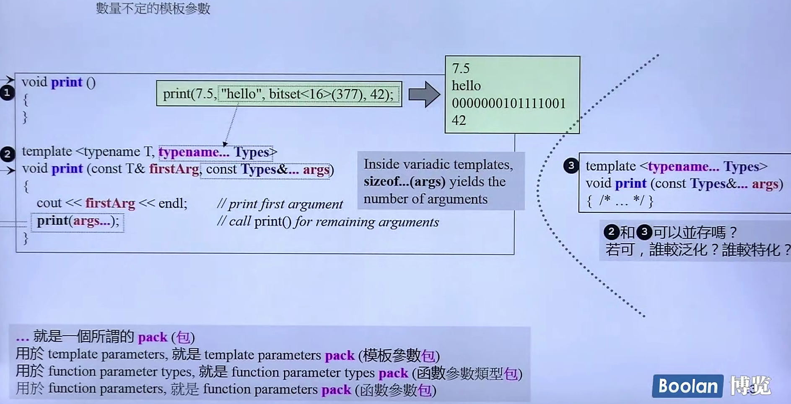
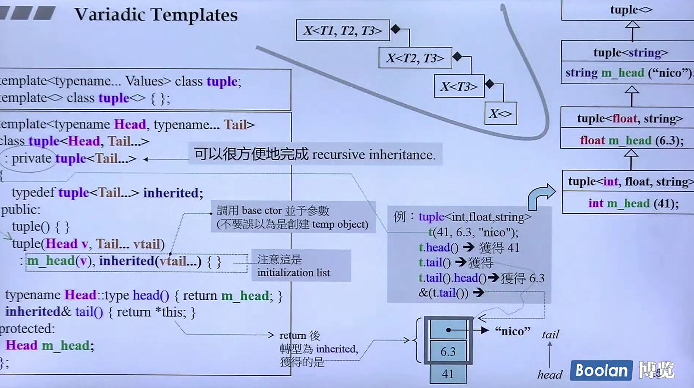

### 网页

C++之父网页 ---- "C++11 - the new ISO C++ standard"
CPlusPlus.com  -- Reference查询资料
CppReference.com
gcc.gnu.org

### 书籍
《Effective Modern C++》（只讲新东西）
《C++ Primer》百科全书
《The C++ Programming Language》百科全书（C++之父所写）
《The C++ Standard Library》

### Header Files

C++ header files 不带后缀名，例如`#include <vector>`
C header files 不带后缀名，例如`#include <cstdio>` 

### Variadic Templates

数量不定的模板参数，可以传递任意个数、任意类型的参数，类型在调用时绑定。

+ **用于函数函数模板**

用作函数递归调用，需要设置无参的同名函数，用作递归出口函数，参数数量为0时调用。


+ **用于类模板**

用作类的递归继承，需要设置无参的模板类


### 模板嵌套

C++11之前必须写为 `vector<list<int> >`，即最后一个`>`前要有空格。
C++11之后可以写为`vector<list<int>>`，不需要空格。

### nullptr和std::nullptr

`nullptr`用来指代**空指针**，类型是`std::nullptr`。不使用`NULL`和`0`

### auto

实参推导机制，自动类型推断。

`auto x = 1`

```cpp

    vector<int> v;
    auto it = v.begin() //type of it is vector<int>::iterator

    auto l = [](int x) -> bool{
        ...;
    }       //type of l is a lambda, representing object
```

