C++ 标准库（Standard Library）包含STL和其他的一些东西，以header files形式呈现

C++标准模板库（Standard Template Library）分为6个部件

+ 容器
+ 分配器
+ 算法
+ 迭代器
+ 适配器
+ 仿函数

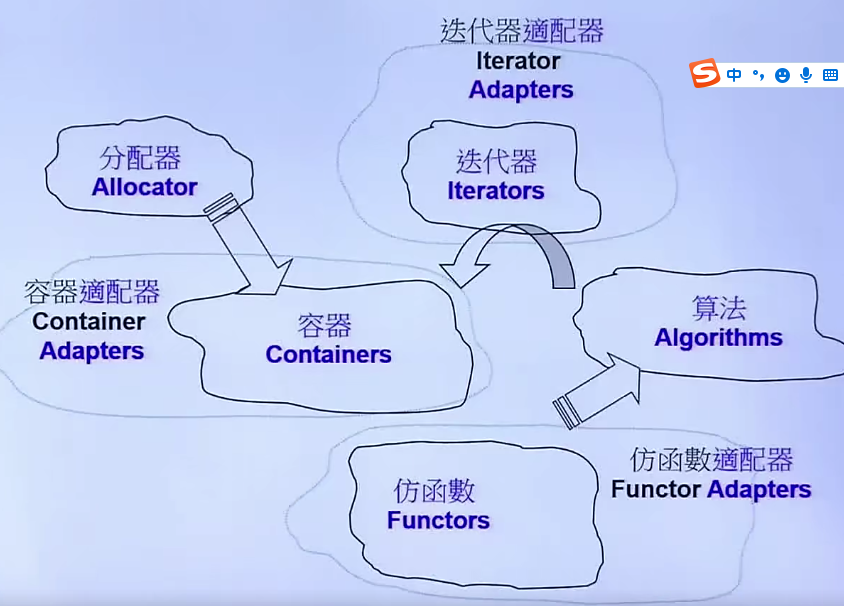

容器之间的关系，基本都是组合类型

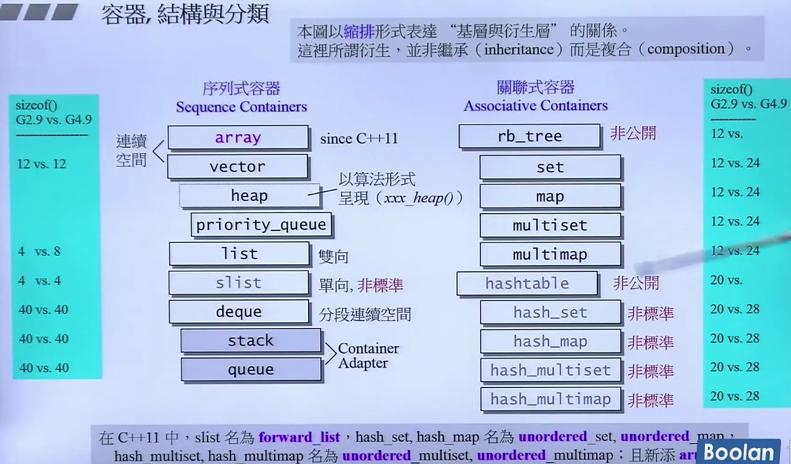

容器的end() 都是最后一个元素的下一个地址

10.15.22.31


## 容器

### **Sequence Container**

#### array 

#include \<array>

array<int, size> c;

c.front() 、 c.back() 、c.data()--数组地址

array没有构造函数和析构函数

迭代器要提供5种相应的类型，算法可以询问一些必要的信息，这样算法才可以采取比较优化的动作

```C++
1. 迭代器类型（random_access_iterator_tag）//制造出连续的假象，可以随机访问。
2. 值类型（value_type）
3. 指针（pointer）
4. 引用（reference）
5. difference_type
```

#### vector

#include\<vector>

push_back() 没有push_front()函数

size() 元素个数

capacity()  vector空间大小

vector的扩容机制： 只能往后扩展

空间不足时，

	1. 要在另外一个地方找一个扩大一倍的空间。 
	2. 将新空间初始化
	3. 拷贝插入点之后的元素
	4. 插入元素

#### list

实质上是一个指向链表结点的指针（G2.9是4个字节，G4.9是8个字节）

动态分配内存

max_size() : 会有系统指定大小

c.sort()  


#### forward_list

只有push_font()

slist = forward_list 是gnu编译器中自带的容器，头文件 #include\<ext\slist> 在ext目录下


#### deque

分段连续

每次声明一个deque，需要分配（16*2 + 4 + 4） = 40个字节。

如果一个元素的字节数大于512，那么一个缓冲区只放一个node（旧版允许指定缓冲区大小，新版不允许，默认就是前面说的那样）

每个buffer存放几个元素，如果buffer用完，就在内存中重新开辟一段空间，用指针指向它；push_back/push_front时如果空间不够  map指针中 后/前一个指针就指向新的buffer，每次扩充1个buffer

insert()函数 ： 如果插入的位置在中间，那么如果说位置左边的元素个数少，则移动左边的元素，否则移动右边的元素。插在最前端和最后端就调用push_front和push_back函数。

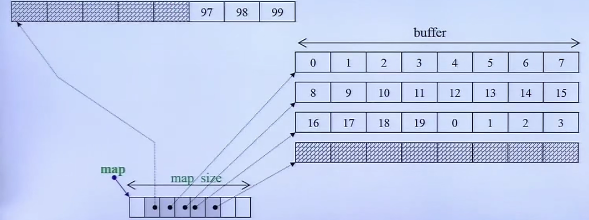

stack和queue底层结构默认的用的是deque，deque可以双向进出。技术上是Adapter。也可以选择list作为底层结构，但是默认的deque一定是要更快的。

不能提供iterator（迭代器），因为有了iterator会操作到中间的元素，而这3个容器是有限制的容器，只能操作两端，因此也不能调用find函数，因为find的参数是iterator类型。

不能选择set或者map作为底层结构。

queue不可以使用vector作为底层元素，而stack可以。

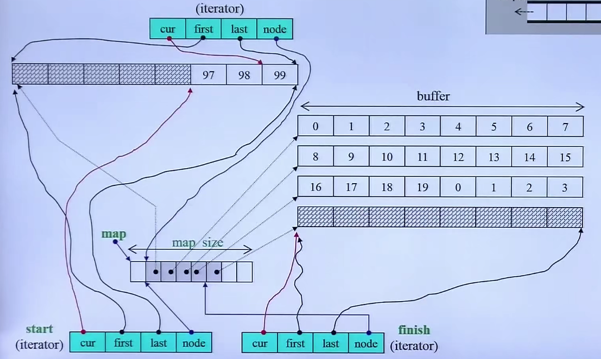

### **associative container**

#### RB-Tree（红黑树）

提供“遍历”操作，并提供iterator。

++iterator，则会得到一个有序序列。可以使用迭代器更改指向的元素。

一个节点可以存放key和data值，key是在红黑树中排好序的，map的key不能改变，迭代器可以改变data值。

通过`insert_unique()`或者`insert_equal()`插入元素，前者不可以插入重复元素，后者可以。

创建红黑树对象需要5个模板参数：`Key、Value、KeyOfValue、Compare、Alloc`。其中Value = key + data。

红黑树类所创建的对象需要分配的内存是9个字节，但是需要对齐，则需要占用12个字节（如果没有设定为16的倍数，则默认是4的倍数）。

对于大小为0的class，创造出来的对象占用的内存大小是1个字节。

#### set/multiset

set有3个模板参数`Key、Compare、Alloc`。底层红黑树`KeyOfValue`采用的是`identity`类型，接受一个参数返回一个参数，这个类型重载了`()`操作符，因此创建的对象是一个**仿函数**。

底层存储结构是红黑树，存储的数据value和key是合二为一的。

set/multiset无法改变元素值，因为底层使用的是红黑树的**const iterator**。

set 的 key 不可以重复，因此 `insert()`底层调用`insert_unique()`。

multiset的 key 可以重复 ， 因此 `insert()`底层调用`insert_equal()`。

set底层的操作都交给红黑树来做，可以看做是一个container adapter 。

c.insert()

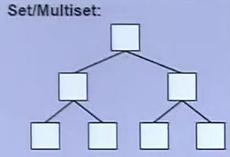


#### map/multimap

map有4个模板参数`Key、DataType、Compare、Alloc`。`pair<const Key,DataType>`对应红黑树的`Value`类型，底层红黑树`KeyOfValue`采用的是`select1st`类型。

迭代器可以改`data`，但是不可以改`key`，因为在pair中 key 被设为`const Key`。

map独有的`[]`操作符重载。采用`lower_bound()`函数在红黑树上进行**二分查找**，如果找到`key`，则返回`data`，如果没找到，则调用`insert()`函数安插进去。

c.insert(pair<first, second>(key, value));            

multimap不能用 [] 做insertion

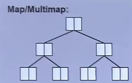


#### hashtable

6个模板参数：`Key、Value、hashfunc、ExtractKey、EqualKey、Alloc`。

放入的元素个数大于`bucket`总数，则需要扩充`bucket`数量到离它的2倍距离最近的质数（rehashing），所有的元素要重新算一遍。

hashtable中有一个`hashfunc`模板参数来计算出每一个要放入的元素的`hashcode`值，然后通过`hashcode`计算放入`hashtable`中的位置。

`hashcode`越乱越好。


#### unordered_multiset/unordered_multimap

底层是hash链表

c.bucket_count() 指的是hash顺序表的长度

hash顺序表的长度一定 大于 元素个数，如果元素个数大于或等于顺序表的个数，那么hash顺序表会扩充，并且打散元素

c.load_factor() 装填因子


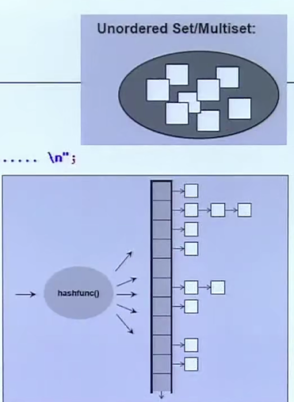


#### allocator

使用std::allocator以外的allocator，就需要#include<ext\\...> gnu编译器的扩展库


##### 源码分析

VC、BC、gnu2.9编译器allocator：

//分配512 ints

int *p = allocator\<int>().allocate(512, (int\*)0 );

allocator\<int>().deallocate(p, 512);

**分配内存**：new()  -->void* operator new(...) -->  malloc --> 操作系统分配内存的指令(linux和windows的不同)

​					allocator类 --> allocate(...) --> _Allocate(...) --> operator new(...) --> malloc --> 操作系统分配内存的指令(linux和windows的不同)

缺点：malloc分配内存时，会分配额外的空间，会带来大量的额外开销（cookie记录整块的大小，调试模式下还需要分配额外的空间），分配的区块小，则区块所占的比例就越小，则开销就越大

**释放内存**：allocator类 --> deallocate(...) --> operator delete(...) --> free

**改良版alloc**：gnu2.91（gnu4.9使用allocator，但是有扩充的allocator -- _pool_alloc，就是G2.9的alloc，

​										用例：vector<string,  _gnu_cxx::__pool_alloc\<string>> vec ;） 

尽量减少malloc的次数，容器的元素大小都是相同的，则不需要使用cookie记录整块的大小

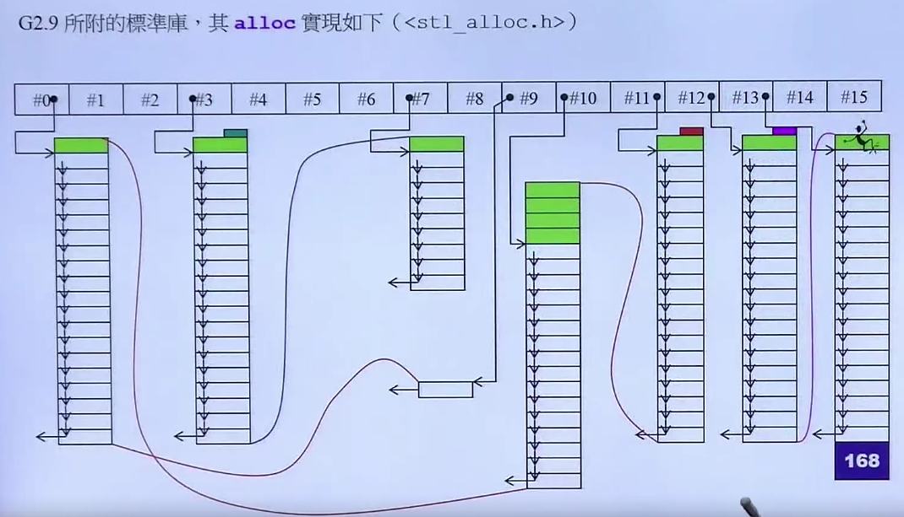


#### 算法

Algorithms看不见Containers，所需要的信息由Iterator提供，Iterators（由Containers供应）必须能够回答Algorithms的所有提问，Algorithms才能找出最好的方式进行操作。

总的来说就是，根据迭代器的类型，算法执行相应的操作。

sort(RandomAccessIterator begin, RandomAccessIterator end,  )


#### 迭代器 和 iterator traits

解决计算机问题的尚方宝剑：加一个中介层

迭代器分类是用structure创建出来的对象来进行分类，声明容器的迭代器 -> 萃取机traits提取类别 -> 根据类别调用相应的重载函数，从而确定迭代器类型。

迭代器共有以下几种类型：

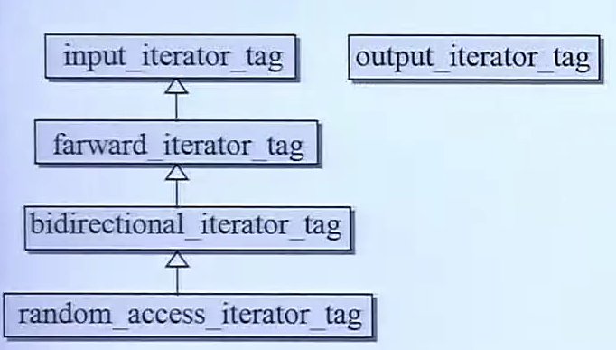

`iterator_category` 和 `type traits`对算法的影响

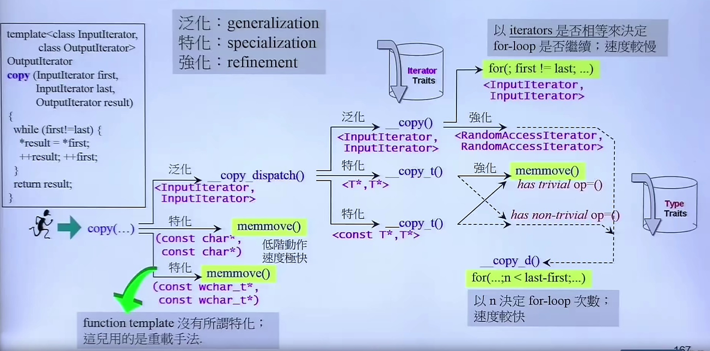

算法源码`iterator_category`是 “暗示” ，而不是“强制”。例如：`sort()`源码是快速排序，需要随机访问，它的源码的模板类型名称是`RandomAccessIterator`，因此告诉维护源码的工作人员，它需要传递`RandomAccessIterator`类型的迭代器，但是可以传递其他类型的迭代器，如果不是这种类型，调用时第一行可以通过，但是后面的操作可能会编译失败。


## 仿函数functors

只为算法服务。比如 排序，要求从小到大排序，那么就需要传进去一个函数对象或者一般函数来改变排序准则。

如果是通过类来传递准则，那么需要在传递参数的时候创建**临时对象**；如果是一般函数，那么只需要传入**函数名**即可。 

因为类中重载了`()`运算符。

如果想要融入STL的体系结构，那么仿函数就需要继承这两个structure其中之一。

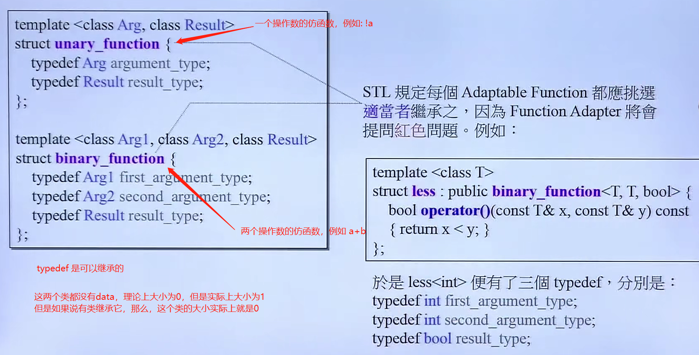


BC、gnu2.91、gnu4.9、VC

继承可以继承`typedef`。

类所占用的大小，只需要看data的大小，如果此类没有data，则看其父类的data大小


测试将函数放到独立空间namespace


全局模板函数  -- :: find(c.begin(), c.end(), target) 传回 iterator

clock() 程序运行到这一行的毫秒数 -- 可用来测试算法速度

sort( c.begin(), c.end() ) -- C++标准库 

bsearch -- C库中的二分查找


后++ 操作符重载调用 前++

区分++i 和 i++ ： 操作符重载有参数是i++，没参数是++i

C++允许++++i，但不允许 i++++

