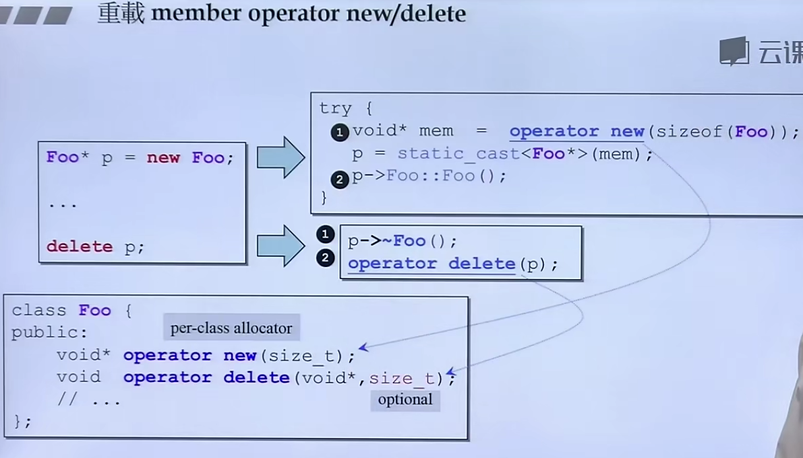

#### 头文件正规写法

#### 头文件布局

#### inline函数

在class body内定义的函数；在里面声明的，在外面要加关键字inline。inline只是对编译器的建议，具体是否是inline函数，由编译器决定，一般inline函数不是太过复杂。

函数重载的本质是 编译器会根据函数名称和参数 将其编译成 指定的编码，同名不同参的函数 编码不同

函数参数和返回值尽量（在可以的情况下）传递引用（效率高），如果不希望对方改，加上const。传递引用时无需知道接收者是以reference接收。

相同class的各个objects互为friend（友元）

定义了const函数对象，操作的函数 也要加上const，因为const的对象不能改变数据成员

将成员函数声明为const，目的是为了告诉编译器，不更改数据成员。

尽量要用初始化列表

函数体内部要创建新空间的时候，不能返回引用，reference主要用于传递

如果类内部带指针，则需要自己设计拷贝构造函数，不要用系统默认的函数，否则两个指针会指向同一个单元。

析构函数用来释放动态分配的内存，如果对象内部有动态分配的内存，则在对象使用完之后死亡之前就会调用一次析构函数

拷贝构造：`String s2(s1)；`以s1为蓝本创建出s2

拷贝赋值：`String s2 = s1；`s2为新创建的对象，将s1赋值给s2，要调用构造函数

浅拷贝：改变指针指向，拷贝指针，会导致内存泄露（系统默认）

深拷贝：将空间的内容拷贝过去，拷贝内容（用户自定义）

拷贝赋值函数：比如对象 s2 = s1

​	首先检测自我赋值，首先是效率高，其次如果不检测会引发错误，因为会将原先的内容删除，再次分配内存时会出现错误

​	接着将s2原先的内容删除，重新分配和s1相同大小的内存空间

​	最后将s1中的内容拷贝到s2中

new：先分配内存，再调用构造函数

delete：先调用析构函数，再释放内存

​	array new一定要搭配 array delete 并且 delete时要采用delete[] p，否则只会删除数组中第一个元素

new 和 delete 操作符的内部实现函数可以被重载，但是影响很大

重载全局

重载成员函数

 new 一个对象数组 在内存中 有4个字节用来存放数组大小

**placement new**

应用：要在暗地里多分配一些东西的时候，需要用到placement new

字符串的reference counting的设计

