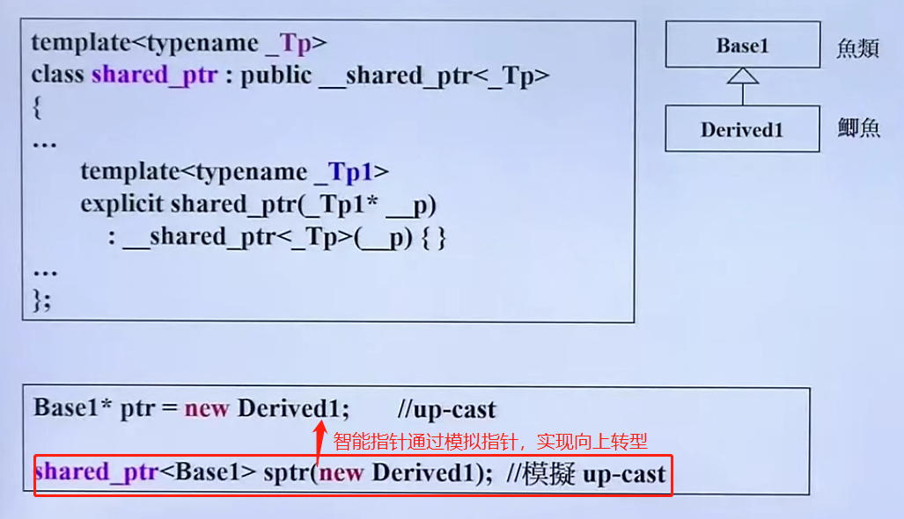

**conversion function转换函数**

没有返回值。

把这种东西转换成其他东西（把 f 转换成double，调用operator double() ）。

 **non-explicit-one-argument tor**

把其他东西转换成这种东西（把4转换成fraction(4, 1)，调用fraction(int num, int den = 1) ）。

**explicit**

基本用在构造函数前

**pointer-like classes 智能指针**

目的：想要比指针多做一些事情，类像一个指针

**function-like classes** 

类像一个函数，又称**仿函数**，里面有**重载小括号**

仿函数都会继承一些奇特的base classes    class大小理论上为0，实际上可能为1

**类模板**

把一些类型抽出来，允许使用者任意指定

**函数模板**

关键字class 可以改为 typename

函数模板在使用时不用指明类型

模板首先编译一次，等到后面再使用的时候会再编译一次

**成员模板**

其中以下图片的 U1 和 U2 要分别继承自 T1 和 T2

**specialization，模板特化**

如果Key指定为char，则调用 

**partial specialization，模板偏特化** -- **个数**的偏

**partial specialization，模板偏特化** -- **范围**的偏

用指针指向任意类型

**模板模板参数**

​	4种智能指针的使用

反例：

**variadic templates** -- C++11

模板参数可变化

reference底层实质上是指针，reference和代表的变量 在同一地址并且 是同一大小 是**假象**。

reference常用于参数传递和函数返回值，通常不用于声明变量。

**虚函数、虚指针 -- vptr、vtbl**

如果想让容器放大小不同的元素，则要放指针，并且指针指向父类

多态 = 动态绑定 = 虚指针+虚表

函数**动态绑定**的3个条件：

1. 必须通过指针来调用
2. 指针是向上转型 -- up_cast
3. 调用的是虚函数

指针有很多种形态 -- 多态

